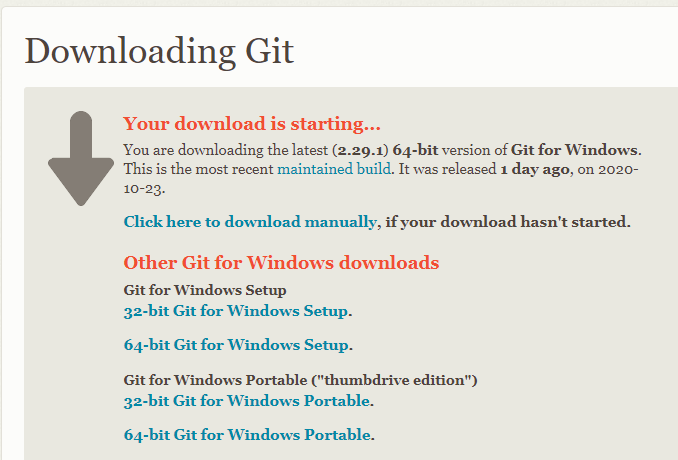
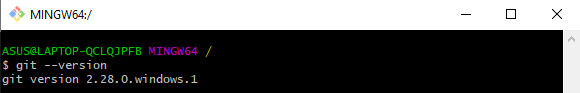
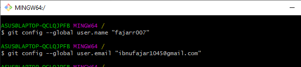

### NAMA : Ibnu Fajar
### KELAS : TI.20.A.1
### NIM : 312010420

### LANGKAH AWAL MENGGUNAKAN GIT

* ### CARA MENDOWNLOAD GIT
   - Hal pertama yang perlu kita lakukan jika ingin menggunakan aplikasi git tentu saja yaitu mendownloadnnya. Bagaimana caranya? Pertama kalian bukalah situs resmi dari git itu sendiri yaitu *git-scm.com*.  
  
   - Setelah kalian mendapat tampilan seperti dibawah ini kalian bisa langsung saja mendownloadnya dengan cara memilih terlebih dahulu yang sesuai dengan komputer atau laptop kalian apakah itu 32bit atau 64bit. Setelahnya kalian bisa langsung menekannya dan akan terdownload otomatis.  
     
    - Setelah installasi terbuka, kalian bisa langsung membuka software *gitbash* pada menu windows kalian dan melakukan pengecekan versi dari git kalian dengan mengetikan syntax: *git --version*  
    - jika sudah mendapat tampilan seperti gambar dibawah ini, itu mengartikan bahwa git kalian telah berhasil terinstall.  
       
     - Selanjutnya yang perlu kita lakukan adalah mengkonfigurasikan username & email kita pada git dengan mengetikan syntax:
    *'git config --global user.name "Nama Anda"'  'git config --global user.email "Email Anda"'*. Seperti pada gambar dibawah.  
      